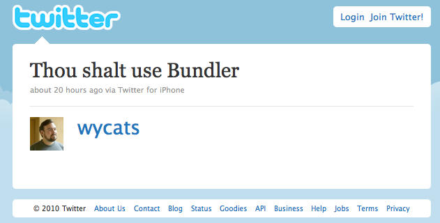

!SLIDE

# Dr. Strangegem
### Or, how I learned to stop worrying and love Bundler

!SLIDE

# Polarizing

!SLIDE

# Brought down from on high

!SLIDE

# Bundler sucks
* Too much trouble
* Wasted time

!SLIDE

# Back up the truck
## A little background...

!SLIDE

@@@ ruby
    # config/environment.rb
    
    require 'rubygems'
    require 'nokogiri'
    require 'timecop'

    Timecop.freeze
    # ...
@@@

!SLIDE

# The old days

    > script/console
    config/environment.rb:3:in `require': 
      no such file to load -- nokogiri (LoadError)
      from myscript.rb:3:in `<main>'

    > gem install nokogiri
    ...
    > ruby myscript.rb
    config/environment.rb:4:in `require': 
      no such file to load -- timecop (LoadError)
      from myscript.rb:4:in `<main>'
    > gem install timecop
    ...

!SLIDE

# Rails 2.x

    > script/console
    Missing the 'nokogiri' gem, please 
      run rake gems:install
    > rake gems:install
    > script/console
    > ...

!SLIDE

# Trouble

    > rake gems:install
    > script/console
    can't activate nokogiri (= 1.5.3), 
      already activated

!SLIDE

# Bundler to the rescue

    > bundle install
    > script/console

!SLIDE

# Brighter Planet gems

    > git clone git://github.com/brighterplanet/flight.git
    > cd flight
    # hack, hack, hack
    > bundle install
    > rake test
    # contribute, contribute, contribute

!SLIDE

# Bundler in a nutshell
  * Uses existing rubygems functionality
  * Allows git and local filesystem as gem sources
  * Manages dependency conflicts
  * Extra tools
  * Gemfile tricks

!SLIDE

# Uses existing rubygems functionality

@@@ ruby
    # Gemfile

    gem 'nokogiri', '>= 1.5.2'
    gem 'capybara'
    gem 'rspec',    '~> 1.3.0'  # spermy!
@@@

!SLIDE

# Git and local filesystem gem sources

@@@ ruby
    # Gemfile

    gem 'earth', :path => '../earth'
    gem 'remote_table', :git => 'git://github.com/dkastner/remote_table.git'
@@@

!SLIDE

# Manages dependency conflicts
  * Prevents "activation" errors
  * Ensure correct environment
  * Gemfile.lock

!SLIDE

# Extra tools

!SLIDE

# Extra tools: bundle exec

    > gem list cucumber

    *** LOCAL GEMS ***

    cucumber (0.6.2, 0.9.0)

    > cucumber --version
    0.9.0

    > bundle exec cucumber features --tag=@wip

!SLIDE

# Extra tools
  * bundle console
  * bundle viz
  * bundle gem

!SLIDE

# Gemfile tricks

!SLIDE

# Gemfile tricks: gemspec

@@@ ruby
    # myproject.gemspec

    Gem::Specification.new do |s|
      # ...
      s.add_runtime_dependency('git', '>= 1.2.5')
      s.add_runtime_dependency('rake', '>= 0')
    end
@@@

@@@ ruby
    # Gemfile

    gemspec, :path => 'myproject.gemspec'
@@@

!SLIDE

# Gemfile tricks: env

@@@ ruby
    # Gemfile

    if ENV['LOCAL_EARTH']
      gem 'earth', :path => ENV['LOCAL_EARTH'] 
    else
      gem 'earth', '2.3.1'
    end
@@@

    > export LOCAL_EARTH=~/earth
    > bundle update
      earth (2.3.2) using path /Users/dkastner/earth
      ...
    > unset LOCAL_EARTH
    > bundle update

!SLIDE

# But, but, but...
  * Bundler is SLOW
  * Version conflicts are annoying

!SLIDE

# Bundler is slow
  * Use ruby 1.9
  * Use a local gem cache

!SLIDE

# Local gem cache

    > mkdir -p ~/local_gems/gems
    > cp `gem env gemdir`/cache/*.gem ~/local_gems/gems
    > cd ~/local_gems
    > gem generate_index
    > gem server -d ~/local_gems

!SLIDE

# Local gem cache

@@@ ruby
    # Gemfile

    if ENV['LOCAL_GEM_SERVER']
      source 'http://localhost:8808'
    else
      source :rubygems
    end
@@@

    > export LOCAL_GEM_SERVER=true
    > bundle update

!SLIDE

# Version conflicts are annoying
  * Use flexible version requirements
    * spermies preferred
  * Bug gem maintainers, or fork

!SLIDE

# Thank you!

* * *

#### Derek Kastner
  * @dkastner
  * http://github.com/dkastner
